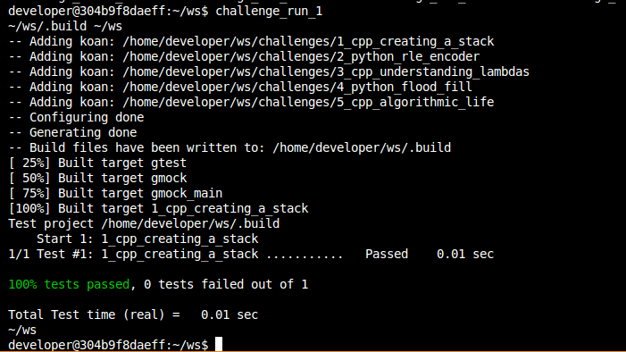
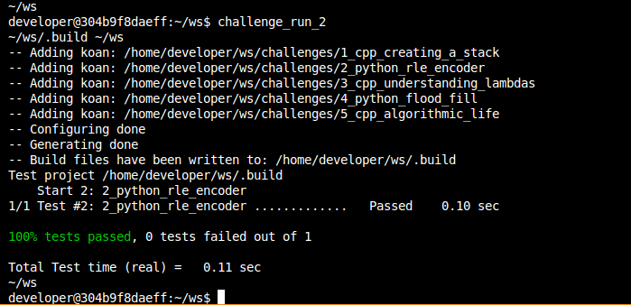
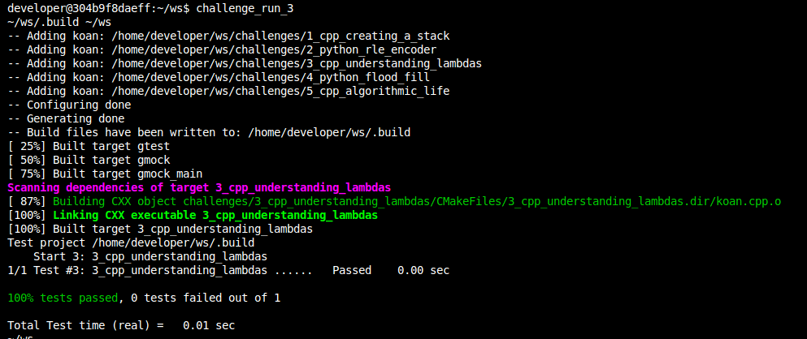
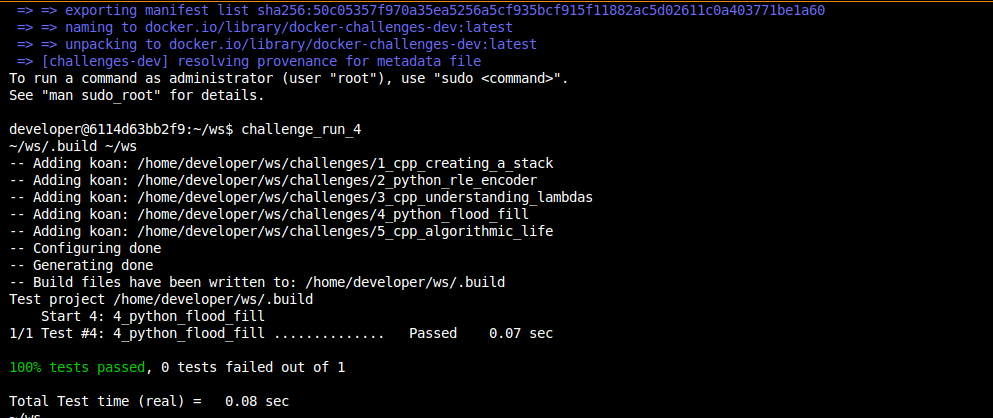
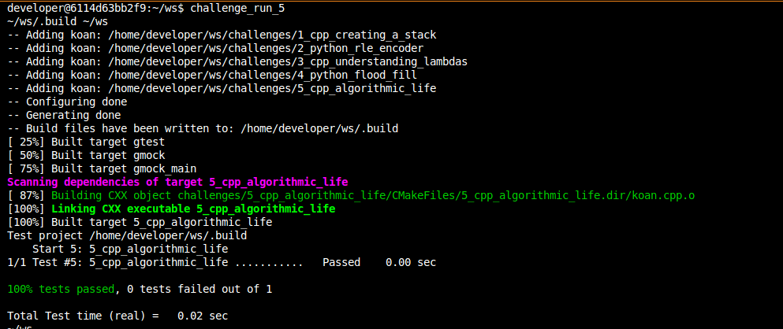

# **Project Documentation**

## **Overview**
This document details the steps taken to complete project requirements, including solving coding challenges and implementing features on python a c++ based on algorithm of robot motion. References to related files and directories are included.

---

## **Initial Setup**

### **1. Repository Setup**
- Cloned the repository and linked it to my GitHub account. Ensured the main branch remained private as per instructions.

### **2. Branch Management**
- Created and utilized the following branches:
  - `main`: Central branch for final versions.
  - `challenge-1`: For development and feature implementations of creation a stack.

  - `challenge-2`: For development and feature implementations of creation an algorithm of decode an encode based on the char values.

  - `challenge-3`: Develop an series of default classes on c++ in order to replace a "vainilla" lambdas functions without changing the program behavior.

  - `challenge-4`: For development of flood fill algorithm common on image filters and processing.
  - `challenge-5`: Develop an a Dijkstra's algorithm to fullfill with the task of find the shortest path between a net of nodes.
  - `merge`: Consolidates changes from other branches.

---

## **Challenges**

### **Challenge 1: Create a Stack Using a Vector**
#### **Description**
Implemented a generic stack data structure using `std::vector`. The stack supports basic operations such as adding, removing, and inspecting elements. This design ensures encapsulation, efficiency, and flexibility.

#### **Key Points**
- Implemented the following operations:
  1. **Push**: Adds an element to the stack (supports copy and move semantics).
  2. **Pop**: Removes the top element.
  3. **Top**: Accesses the top element (both `const` and non-`const`).
  4. **Empty**: Checks if the stack is empty.
- Exception handling ensures robust operations:
  - Throws `std::out_of_range` when attempting invalid `pop` or `top` operations on an empty stack.

#### **Testing**
- Verified the stack's functionality using GoogleTest:
  - Added unit tests for `push`, `pop`, `top`, and `empty` methods.
  - Ensured proper behavior when attempting invalid operations.
- File: [`koan.cpp`](challenges/1_cpp_creating_a_stack/koan.cpp).

---

### **Challenge 2: RLE Encoder and Decoder**
#### **Description**
Designed and implemented a Run-Length Encoding (RLE) algorithm. This algorithm compresses a string by replacing sequences of repeated characters with a single character followed by its count.

#### **Key Points**
- The implementation supports two main operations:
  1. **Encode**: Compresses the input string by applying RLE.
  2. **Decode**: Reconstructs the original string from its RLE-compressed form.
- The algorithm is robust and handles edge cases such as:
  - Strings with no repetitions.
  - Strings containing special characters.
  - Empty strings.

#### **Testing**
- Verified correctness and performance using GoogleTest:
  - Tested encoding with various input scenarios (e.g., repetitive and non-repetitive strings).
  - Decoded the output and ensured it matched the original input.
  - Validated the handling of edge cases like empty strings.
- File: [`koan.py`](challenges/2_python_rle_encoder/koan.py).

### **Challenge 3: Classes with lambdas**
#### **Description**
Replaced lambdas with equivalent classes to achieve the same functionality while maintaining mutability and captures.

#### **Key Points**
- Converted lambdas in four scenarios:
  1. Simplest lambda: Captures by copy.
  2. Counting lambda: Implements state mutation.
  3. Parameterized lambda: Uses parameters and captures.
  4. Capture-by-move lambda: Moves unique resources.

#### **Testing**
- Verified class functionality with GoogleTest:
  - Ensured proper state tracking.
  - Validated correctness for all lambda replacements.
- File: [`koan.cpp`](challenges/3_cpp_understanding_lambdas/koan.cpp).

---

### **Challenge 4: Flood Fill Algorithm**
#### **Description**
Implemented the `ConnectedRegionPainter` class to solve the flood fill problem using Python. The algorithm modifies a 2D grid starting from a target cell, filling connected regions with a new color.

#### **Key Points**
- Implemented methods to:
  - Access pixel colors (`get_pixel`).
  - Modify pixel colors (`set_pixel`).
  - Validate grid boundaries (`is_valid_pixel`).
  - Perform flood fill recursively and iteratively (`flood_fill` and `star_color`).

#### **Testing**
- Verified using unittest framework:
  - Created test cases with various grid configurations.
  - Validated output against expected results.
- File: [`koan.py`](challenges/4_python_flood_fill/koan.py).

---

### **Challenge 5: Shortest Path in a Graph**
#### **Description**
Implemented Dijkstra’s algorithm to find the shortest path between nodes in a weighted graph using C++.

#### **Key Points**
- Designed the `ShortestPathCalculator` class with:
  - `add_vertex()`: Adds vertices to the graph.
  - `add_edge()`: Connects vertices with weighted edges.
  - `shortest_path()`: Implements Dijkstra’s algorithm using a priority queue.
- Handled edge cases:
  - Missing or disconnected nodes.
  - Cycles and unreachable paths.

#### **Testing**
- Conducted extensive tests using GoogleTest:
  - Validated functionality with simple and complex graphs.
  - Checked path reconstruction for nodes in loops or disconnected segments.
- File: [`koan.cpp`](challenges/5_cpp_algorithmic_life/koan.cpp).

### **3. Command Nomenclature**
> [UPDATE] To update an actual feature developed, this in case to change some of the functionality of the code.

> [FIX] To fix some issue that appear on the testing of the product, this allow to know on the flow where and when it was produced.

> [FEATURE] To include any of the task or and comments related in case to use doctrings or doxygen.

> [FINAL] To give timestamp to the last commit.

### **4. Global Testing**
- Ran all the codes as a prove of behavior.

## Challenge 1

  

- Test of the code challenge 1.

## Challenge 2

  

- Test of the code challenge 2.

## Challenge 3

  

- Test of the code challenge 3.

## Challenge 4

  

- Test of the code challenge 4.

## Challenge 5

  

- Test of the code challenge 5.