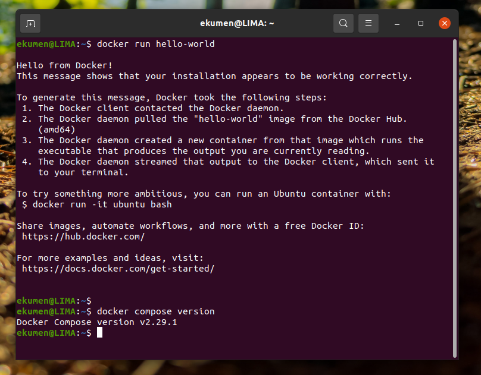
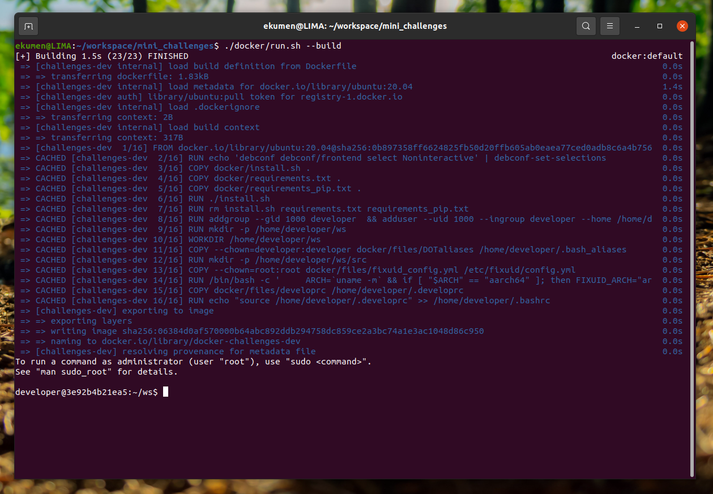
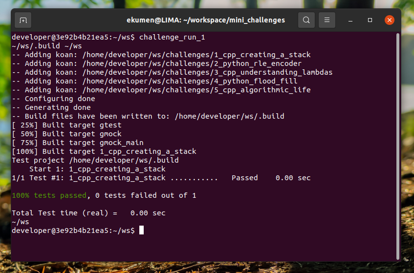

## Requirements

This repository is intended to be self-contained. To that effect we have provided a Dockerfile that you can use to build an image with all the necessary dependencies to run the challenges.

You'll need a Linux machine with Docker and Docker-Compose installed to build the image. If you don't have Docker installed, you can find instructions on how to install it [here](https://docs.docker.com/engine/install/ubuntu/#install-using-the-convenience-script). You will probably also want to run the post-installation steps to run Docker as a non-root user [here](https://docs.docker.com/engine/install/linux-postinstall/#manage-docker-as-a-non-root-user).

To check if your installation is working, you can run the following command:

```bash
docker run hello-world
```

 You'll see a message that confirms that your installation is working. Next try

```bash
docker compose version
```

If you see a message with the version of docker-compose you have installed, you are ready to go.



## Usage

#### Starting the container

Step into the root directory of the repository and run the following command:

```bash
./docker/run.sh --build
```



This will build the Docker image and start a container with the necessary dependencies to run the challenges. The first time you run this command, it will take a while to download the necessary dependencies, but subsequent runs will be faster.

To exit the container, you can type `exit` or press `Ctrl+D`.

#### Solving and running the challenges

The challenges are shaped as unit tests you need to pass. You can find the challenges in the `challenges` directory. Each of them contains a single `koan.py` or `koan.cpp` file where you should write your solution.

Each file contains both the problem statement and the test cases you need to pass. The sections of the code where you're supposed to write your solution are marked with `BEGIN EDIT` and `END EDIT` comments. Feel free to make other changes to the file if you need to, as long as you don't modify the test cases.

You can check if your solution satisfies the test cases by running `challenge_run_<N>` from the docker container terminal, where `<N>` is the number of the challenge you want to run (can take values between 1 and 5). For example, to run the first challenge, you must type in the terminal:

```bash
challenge_run_1
```
This will build and run your code, and let you know if you passed or failed the unit tests.


